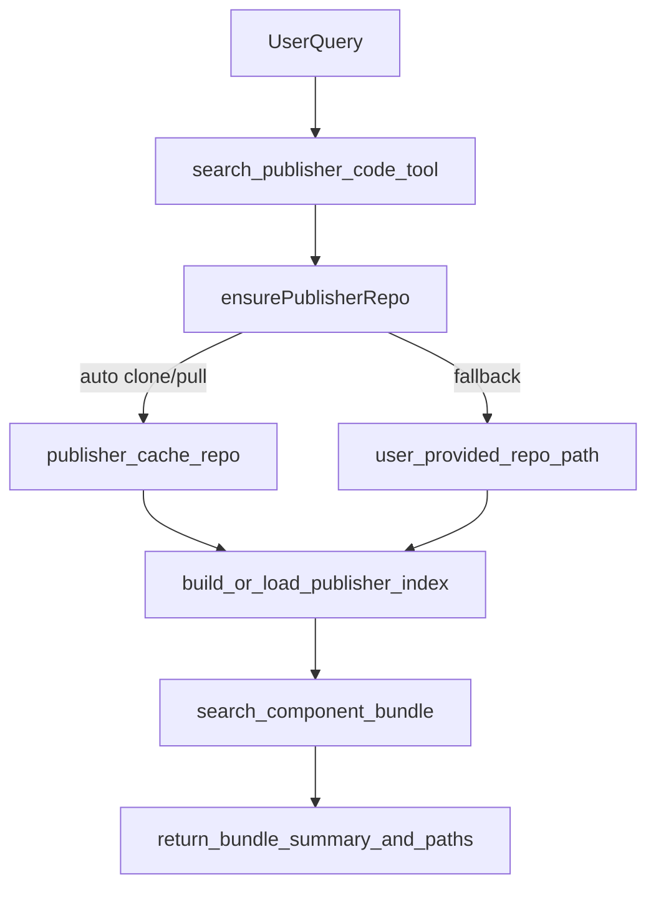

# Step2 Publisher 통합 실행 계획

## 목표

- Figma 중심 MCP에 Publisher 검색을 붙여, 개발자가 `기획 -> 퍼블 코드 번들`까지 한 번에 찾게 한다.
- 운영 방식은 **hybrid sync**: 자동 clone/pull 우선, 실패 시 사용자 지정 로컬 경로 fallback.
- 응답 형식은 **component bundle**: 화면과 관련된 파일 묶음(예: template/script/style/공통 컴포넌트) 요약 중심.

## 설계 요약

## 구현 단계

### 1) Step2 기반 구조 추가

- 신규 서비스: [src/services/publisher.ts](src/services/publisher.ts)
  - `ensureRepo()` : 자동 clone/pull + fallback 경로 처리
  - `buildIndex()` : 퍼블 파일 인덱싱(JSON)
  - `searchBundle()` : 화면/키워드 기반 관련 파일 묶음 탐색
- 신규 tool: [src/tools/search-publisher-code.ts](src/tools/search-publisher-code.ts)
  - 질의 파싱 + 서비스 호출 + bundle 응답 포맷
- MCP 등록 확장: [src/index.ts](src/index.ts)
  - `search_publisher_code` tool schema/라우팅 추가

### 2) 퍼블 저장소 동기화 전략 (hybrid)

- 자동 경로(기본): `~/.oke-front-mcp/publisher/okestro-ui`
- 환경변수/설정 우선순위:
  1. `PUBLISHER_REPO_PATH` (명시 경로)
  2. 자동 캐시 경로
- 동기화 정책:
  - repo 없으면 clone
  - repo 있으면 `git pull --ff-only`
  - 자동 동기화 실패 시 fallback 경로 탐색
- 실패 응답에 원인/해결 가이드 포함(권한/SSH/경로)

### 3) 인덱스 모델 설계

- 신규 인덱스 파일: [data/publisher-index.json](data/publisher-index.json)
- 주요 필드(1차):
  - `project` (`publishing-contrbass`, `publishing-viola` 등)
  - `filePath`, `componentName`, `keywords`
  - `styleRefs`(sass 파일), `sharedComponentRefs`(`src/components`)
  - `lastIndexedAt`, `gitCommit`
- 검색은 화면명/메뉴명/기능명 키워드 + 프로젝트 범위 필터 조합으로 시작

### 4) Component Bundle 응답 포맷

- 1차 응답(요약):
  - 메인 후보 1~3개
  - 각 후보의 관련 파일 묶음(뷰/스크립트/스타일/공통 컴포넌트)
  - 빠른 복사 대상 우선순위
- 2차 응답(확장):
  - 선택 후보의 코드 스니펫(핵심 블록만)
  - 데이터 바인딩 수정 포인트 안내

### 5) 기존 Figma 흐름과 연결

- [src/tools/search-figma-spec.ts](src/tools/search-figma-spec.ts)에서
  - 화면 확정 후 "연관 퍼블 코드 찾기" 후속 액션 힌트 제공
- 추후 Step2.5에서 `search_figma_spec`와 `search_publisher_code`의 연속 호출 UX 통합

### 6) 운영 및 품질

- 성능: 초기 인덱싱 1회 + 변경 시 증분 갱신
- 안정성: pull 실패 시 기존 인덱스로 read-only 검색 유지
- 로그: clone/pull/index/search 단계별 결과 기록
- 테스트:
  - repo 없음 상태 자동 clone
  - clone 실패 시 fallback 경로 검색
  - 프로젝트별 검색 정확도(contrbass/viola)
  - `src/components` 공통 컴포넌트 참조 탐지

### 7) 문서 동기화

- 범위/사용법: [docs/README.md](docs/README.md)
- 검색 흐름: [docs/SEARCH_FLOW.md](docs/SEARCH_FLOW.md)
- 구현 상세: [docs/DEVELOPMENT.md](docs/DEVELOPMENT.md)
- 장애 대응: [docs/DEBUG.md](docs/DEBUG.md)
- 계획 체크: [docs/PLAN.md](docs/PLAN.md)
- 설치/권한: [docs/SETUP_GUIDE.md](docs/SETUP_GUIDE.md)

## 바로 착수 순서

1. Publisher 서비스/Tool 뼈대 생성
2. hybrid clone/pull + fallback 경로 로직 구현
3. 인덱스 생성/검색 최소 기능 구현
4. component bundle 응답 포맷 구현
5. 테스트/문서 반영
