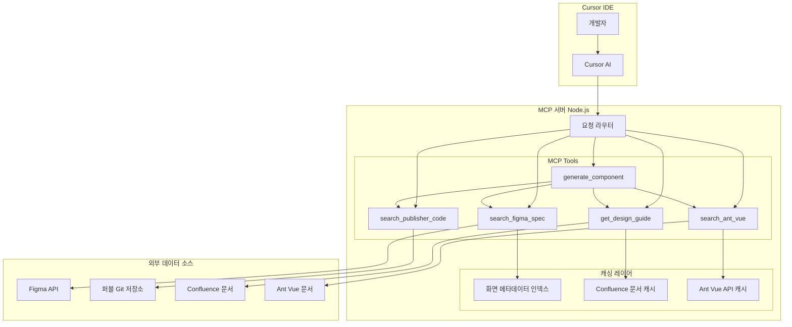

# 프론트엔드 개발 통합 MCP 서버 개발 계획서

**프로젝트명**: oke-front-mcp  
**목적**: 사내 프론트엔드 개발자들의 개발 효율성 향상  
**작성일**: 2026-01-18

---

## 📋 목차

1. [프로젝트 개요](#1-프로젝트-개요)
2. [현재 문제점 및 해결 방안](#2-현재-문제점-및-해결-방안)
3. [시스템 아키텍처](#3-시스템-아키텍처)
4. [핵심 기능 명세](#4-핵심-기능-명세)
5. [기술 스택](#5-기술-스택)
6. [구현 단계](#6-구현-단계)
7. [사용 시나리오](#7-사용-시나리오)
8. [기대 효과](#8-기대-효과)

---

## 1. 프로젝트 개요

### 1.1 배경

현재 프론트엔드 개발 과정에서 **여러 소스의 정보**를 참고해야 하는 불편함이 존재:

```
📱 Figma (기획서)
    ↓
📂 퍼블리셔 레포 (HTML/CSS 목업)
    ↓
📚 Confluence (디자인시스템 문서)
    ↓
🎨 Ant Vue (UI 컴포넌트 라이브러리)
    ↓
💻 개발 시작
```

**문제점**:
- 정보가 흩어져 있어 참고 자료 찾는데 시간 소요
- 각 소스를 일일이 열어봐야 함
- 기획 의도와 디자인 가이드를 놓치기 쉬움

### 1.2 목표

**Cursor AI를 통해 자연어로 질문하면 필요한 모든 정보를 통합 제공하는 MCP 서버 구축**

```
개발자: "콘트라베이스 3.0.6 로드밸런서 모니터링 화면 개발해줘"

MCP가 자동으로:
✅ Figma에서 기획 내용 조회
✅ 퍼블 레포에서 HTML/CSS 구조 찾기
✅ Confluence에서 디자인 가이드 확인
✅ Ant Vue 컴포넌트 API 제공
✅ 통합된 Vue 컴포넌트 템플릿 생성
```

---

## 2. 현재 문제점 및 해결 방안

### 2.1 현재 개발 워크플로우

```
1. 기획 Figma 확인
2. 퍼블 레포 확인
3. CSS (git submodule update)
4. 퍼블 코드 복사
5. 백엔드 데이터 API 추가 및 가공
6. 데이터 화면에 렌더링
7. 추가 액션 기획에 맞게 구현
8. Ant Vue 문서 확인
9. 기능 구현
10. QA: 기획 대조 확인
11. 디자인 컴포넌트 사용법 확인
```

### 2.2 MCP 도입 후 워크플로우

```
1. Cursor에서 자연어로 요청
   "콘트라베이스 3.0.6 CONT-05_04_54 개발해줘"

2. MCP가 자동으로:
   ✅ Figma 기획서 조회 및 요구사항 파악
   ✅ 퍼블 레포에서 HTML/CSS 구조 찾기
   ✅ Confluence 디자인 가이드 적용
   ✅ Ant Vue 컴포넌트 선택 및 API 제공
   ✅ 통합된 Vue 컴포넌트 템플릿 생성

3. 개발자는 비즈니스 로직에만 집중
   - 백엔드 API 연동
   - 데이터 가공
   - 액션 구현

4. QA 및 최종 확인
```

**예상 시간 단축**: 단계 1~8을 **수 분으로 압축**

---

## 3. 시스템 아키텍처

### 3.1 전체 구조



### 3.2 데이터 흐름

#### 시나리오 1: 화면 ID 직접 지정
```
개발자: "CONT-05_04_54 기획 보여줘"
   ↓
MCP: search_figma_spec(screenId="CONT-05_04_54")
   ↓
1. 화면 ID 패턴 감지 (CONT-XX_YY_ZZ)
2. Figma API 직접 호출
3. 기획 내용 반환
   ↓
결과 표시
```

#### 시나리오 2: 자연어 검색
```
개발자: "콘트라베이스 3.0.6 클라우드 뷰 인스턴스 복제"
   ↓
MCP: search_figma_spec(query="클라우드 뷰 인스턴스 복제", version="3.0.6")
   ↓
1. 키워드 추출: ["클라우드 뷰", "인스턴스", "복제"]
2. 메타데이터 인덱스 검색
3. 매칭 점수 계산
4. 후보 정렬
   ↓
후보 목록 제시 (3개)
   ↓
개발자 선택
   ↓
Figma API 호출 → 결과 반환
```

---

## 4. 핵심 기능 명세

### 4.1 Figma 기획서 조회

#### Tool: `search_figma_spec`

**기능**: Figma 기획서를 조회합니다. 화면 ID 또는 자연어로 검색 가능.

**입력**:
```typescript
{
  query: string,        // "CONT-05_04_54" 또는 "로드밸런서 모니터링"
  project?: string,     // 기본값: "CONTRABASS"
  version: string,      // "3.0.6"
  autoConfirm?: boolean // 1개 매칭 시 자동 실행 (기본값: true)
}
```

**출력**:
```typescript
{
  screenId: "CONT-05_04_54",
  pageTitle: "로드밸런서_상세 (모니터링)",
  author: "김가영2, 김소영",
  version: "3.0.6",
  description: "...",  // 전체 기획 내용
  components: [],      // 사용된 컴포넌트 목록
  changelog: "..."     // 변경 이력
}
```

**처리 로직**:
```javascript
1. 화면 ID 패턴 감지 (CONT-XX_YY_ZZ)
   → 있으면: 직접 Figma API 호출
   → 없으면: 키워드 검색

2. 키워드 검색:
   a. 메타데이터 인덱스 로드
   b. 버전 필터링
   c. 키워드 매칭 및 점수 계산
   d. 정렬 및 상위 N개 선택
   
3. 결과 처리:
   - 0개: 검색 실패 메시지
   - 1개: 자동 조회 (autoConfirm=true)
   - 2개 이상: 후보 제시

4. Figma API 호출:
   GET /v1/files/{fileKey}/nodes?ids={nodeId}&depth=8
   
5. 텍스트 추출 및 구조화
```

#### Resource: `figma://screens`

**기능**: 프로젝트의 모든 화면 목록 제공

**출력**:
```json
{
  "project": "CONTRABASS",
  "version": "3.0.6",
  "totalScreens": 194,
  "screens": [
    {
      "id": "CONT-05_04_54",
      "name": "로드밸런서_상세 (모니터링)",
      "author": "김가영2, 김소영",
      "keywords": ["로드밸런서", "모니터링"],
      "lastModified": "2026-01-16"
    }
  ]
}
```

---

### 4.2 퍼블리셔 레포 검색

#### Tool: `search_publisher_code`

**기능**: 퍼블리셔 Git 저장소에서 HTML/CSS 코드 검색

**입력**:
```typescript
{
  query: string,           // "모달", "테이블"
  fileType?: "html" | "css" | "all",
  screenId?: string        // "CONT-05_04_54"
}
```

**출력**:
```typescript
{
  matches: [
    {
      file: "pages/modal-example.html",
      path: "/pub/components/modal/",
      code: "<div class='modal'>...</div>",
      lineNumber: 15
    }
  ]
}
```

**처리 로직**:
```javascript
1. Git 저장소 확인 (없으면 clone, 있으면 pull)
2. fast-glob으로 파일 검색
3. 키워드 매칭
4. 코드 스니펫 추출
5. 매칭도 순으로 정렬
```

---

### 4.3 디자인 가이드 조회

#### Tool: `get_design_guide`

**기능**: Confluence 디자인시스템 가이드 조회

**입력**:
```typescript
{
  componentName: string,  // "button", "table"
  category?: "color" | "typography" | "spacing" | "component"
}
```

**출력**:
```typescript
{
  component: "button",
  guidelines: {
    sizes: ["small", "medium", "large"],
    colors: ["primary", "secondary", "danger"],
    usage: "...",
    examples: "..."
  }
}
```

**처리 로직**:

**옵션 A: Confluence API 사용** (추천)
```javascript
1. Confluence REST API 호출
   GET /wiki/rest/api/content/search?cql=text~"button"
2. 페이지 내용 조회
3. HTML → Markdown 변환
4. 캐싱 (1일)
```

**옵션 B: Export 파일 사용**
```javascript
1. data/confluence/ 폴더에서 Markdown 로드
2. 컴포넌트명으로 파일 매칭
3. 내용 반환
```

---

### 4.4 Ant Vue 가이드 검색

#### Tool: `search_ant_vue`

**기능**: Ant Vue 컴포넌트 API 및 사용 예제 제공

**입력**:
```typescript
{
  componentName: string,  // "Table", "Modal"
  searchType?: "api" | "example" | "all"
}
```

**출력**:
```typescript
{
  component: "a-table",
  props: {
    dataSource: "Array",
    columns: "Array",
    pagination: "Boolean | Object"
  },
  events: ["change", "expand"],
  examples: [
    {
      title: "기본 사용",
      code: "<a-table :dataSource='data' :columns='columns' />"
    }
  ]
}
```

**처리 로직**:
```javascript
1. 공식 문서 캐시 확인
2. 없으면 antdv.com에서 크롤링
3. API 정보 파싱
4. 예제 코드 추출
5. 캐싱 (1주일)
```

---

### 4.5 Vue 컴포넌트 템플릿 생성

#### Tool: `generate_component`

**기능**: 퍼블 코드 + Vue 구조를 결합한 컴포넌트 템플릿 생성

**입력**:
```typescript
{
  screenId: string,         // "CONT-05_04_54"
  componentName: string,    // "LoadBalancerMonitoring"
  useAntComponents: string[] // ["a-table", "a-card"]
}
```

**출력**:
```vue
<template>
  <!-- 퍼블 HTML 구조 -->
  <div class="loadbalancer-monitoring">
    <a-card title="서버 상태">
      <!-- Figma 기획 내용 기반 -->
    </a-card>
    
    <a-table
      :dataSource="monitoringData"
      :columns="columns"
    />
  </div>
</template>

<script setup lang="ts">
import { ref, computed } from 'vue';

// TODO: 백엔드 API 연동
const monitoringData = ref([]);

// Figma 기획 내용:
// - 5분마다 데이터 수집
// - Inbound/Outbound 트래픽 표시
// - 서버 상태: ONLINE/WARNING/ERROR

</script>

<style scoped>
/* 퍼블 CSS */
.loadbalancer-monitoring {
  /* ... */
}
</style>
```

**처리 로직**:
```javascript
1. search_figma_spec() 호출 → 기획 내용 파악
2. search_publisher_code() 호출 → HTML/CSS 구조
3. get_design_guide() 호출 → 디자인 규칙
4. search_ant_vue() 호출 → 컴포넌트 API
5. 템플릿 생성:
   - <template>: 퍼블 HTML + Ant Vue 컴포넌트
   - <script>: Vue3 Composition API 구조
   - <style>: 퍼블 CSS
   - 주석: Figma 기획 내용 요약
```

---

## 5. 기술 스택

### 5.1 MCP 서버

- **언어**: TypeScript / Node.js 18+
- **프레임워크**: MCP SDK (`@modelcontextprotocol/sdk`)
- **의존성**:
  - `axios`: HTTP 요청
  - `simple-git`: Git 저장소 조작
  - `fast-glob`: 파일 검색
  - `cheerio`: HTML 파싱
  - `dotenv`: 환경 변수 관리

### 5.2 데이터 소스

| 소스 | 접근 방법 | 인증 |
|------|-----------|------|
| **Figma** | REST API | Personal Access Token |
| **퍼블 Git** | Git Clone/Pull | SSH Key 또는 Token |
| **Confluence** | REST API 또는 Export | API Token |
| **Ant Vue** | 공식 문서 크롤링 | 불필요 |

### 5.3 캐싱 전략

```javascript
// 메타데이터 인덱스 (screen-index.json)
{
  "lastUpdated": "2026-01-18T10:00:00Z",
  "screens": [...]
}

// 업데이트 주기
- Figma 인덱스: 1일 1회 (또는 수동)
- Confluence 캐시: 1일
- Ant Vue 캐시: 1주일
- 퍼블 레포: 실시간 (git pull)
```

---

## 6. 구현 단계

### Phase 1: 기본 인프라 (1주)

**목표**: MCP 서버 기본 구조 및 Figma 연동

**작업 항목**:
- [ ] MCP 서버 프로젝트 초기 설정
  - package.json, tsconfig.json
  - 폴더 구조 생성
- [ ] Figma API 연동
  - Personal Access Token 설정
  - 기본 API 호출 함수
- [ ] `search_figma_spec` Tool 구현 (화면 ID 직접 조회만)
- [ ] Cursor 연동 테스트

**완료 기준**:
- "CONT-05_04_54 보여줘" 명령이 작동

---

### Phase 2: 메타데이터 인덱싱 (1주)

**목표**: 자연어 검색을 위한 화면 메타데이터 수집

**작업 항목**:
- [ ] 메타데이터 수집 스크립트
  - 모든 화면의 Page Title 수집
  - screen-index.json 생성
- [ ] 키워드 추출 로직
- [ ] 검색 알고리즘 구현
  - 키워드 매칭
  - 점수 계산
  - 정렬
- [ ] 후보 제시 UI

**완료 기준**:
- "콘트라베이스 3.0.6 로드밸런서 모니터링" 자연어 검색 작동
- 후보 목록 제시 및 선택 가능

---

### Phase 3: 퍼블 레포 연동 (1주)

**목표**: 퍼블리셔 코드 검색 및 제공

**작업 항목**:
- [ ] Git 저장소 연동
  - Clone/Pull 로직
  - SSH Key 설정
- [ ] `search_publisher_code` Tool 구현
  - 파일 검색
  - 코드 추출
- [ ] `publisher://file-tree` Resource 구현

**완료 기준**:
- "모달 퍼블 코드 찾아줘" 명령이 작동
- HTML/CSS 코드 스니펫 반환

---

### Phase 4: Confluence & Ant Vue 연동 (1주)

**목표**: 디자인 가이드 및 컴포넌트 API 제공

**작업 항목**:
- [ ] Confluence 연동
  - API 또는 Export 파일 결정
  - `get_design_guide` Tool 구현
- [ ] Ant Vue 문서 크롤링
  - 공식 문서 파싱
  - `search_ant_vue` Tool 구현
- [ ] 캐싱 메커니즘

**완료 기준**:
- "버튼 디자인 가이드" 명령이 작동
- "Table 컴포넌트 API" 조회 가능

---

### Phase 5: 컴포넌트 템플릿 생성 (1주)

**목표**: 통합 정보를 바탕으로 Vue 컴포넌트 자동 생성

**작업 항목**:
- [ ] `generate_component` Tool 구현
  - 4개 소스 통합
  - Vue SFC 템플릿 생성
- [ ] 템플릿 커스터마이징 옵션
- [ ] 주석 및 TODO 자동 생성

**완료 기준**:
- "CONT-05_04_54 컴포넌트 생성해줘" 명령으로 완성된 .vue 파일 생성

---

### Phase 6: 최적화 & 고도화 (2주)

**목표**: 성능 개선 및 추가 기능

**작업 항목**:
- [ ] 자동 재인덱싱 (스케줄러)
- [ ] 검색 알고리즘 개선 (유사도 계산)
- [ ] 에러 핸들링 강화
- [ ] 로깅 및 모니터링
- [ ] 사용자 피드백 반영
- [ ] 문서화

**완료 기준**:
- 안정적인 운영 가능
- 팀 전체 사용 시작

---

## 7. 사용 시나리오

### 시나리오 1: 신규 화면 개발

```
개발자: "콘트라베이스 3.0.6 CONT-05_04_54 개발 시작할게"

MCP 응답:
━━━━━━━━━━━━━━━━━━━━━━━━━━━━━
📋 CONT-05_04_54 - 로드밸런서_상세 (모니터링)

✅ 기획 요구사항:
- 5분마다 데이터 수집
- Inbound/Outbound 트래픽 표시
- 서버 상태: ONLINE(녹색)/WARNING(노란색)/ERROR(빨간색)
- 최고 속도 지표 (1day 기준)

📁 퍼블 코드:
- HTML: pub/pages/monitoring/loadbalancer.html
- CSS: pub/styles/monitoring.css

📚 디자인 가이드:
- 상태 카드 색상 규칙
- 간격: 20px 그리드 시스템

🎨 Ant Vue 컴포넌트:
- a-card (서버 상태)
- a-table (트래픽 테이블)
- a-popover (상세 정보)

💻 컴포넌트 템플릿을 생성할까요? (yes/no)
━━━━━━━━━━━━━━━━━━━━━━━━━━━━━

개발자: "yes"

MCP: ✅ LoadBalancerMonitoring.vue 파일을 생성했습니다.
[파일 경로 표시]
```

---

### 시나리오 2: 자연어 검색

```
개발자: "콘트라베이스 3.0.6에서 클라우드 뷰에 인스턴스 복제 
        기능이 추가됐다는데 어떤 내용인지 확인해줘"

MCP 응답:
━━━━━━━━━━━━━━━━━━━━━━━━━━━━━
🔍 "클라우드 뷰 인스턴스 복제"로 3개의 화면을 찾았습니다:

1. CONT-00_01_02 - 클라우드 뷰_인스턴스 복제 ⭐ (가장 관련도 높음)
   담당: 김민지
   키워드: 클라우드뷰, 인스턴스, 복제, 생성
   
2. CONT-00_01_05 - 클라우드 뷰_인스턴스 목록
   담당: 김은정
   키워드: 클라우드뷰, 인스턴스, 목록
   
3. CONT-02_03_01 - 인스턴스 복제 확인 팝업
   담당: 김소영
   키워드: 인스턴스, 복제, 팝업, 확인

어떤 화면을 보시겠습니까? (번호 또는 'all')
━━━━━━━━━━━━━━━━━━━━━━━━━━━━━

개발자: "1"

MCP: [CONT-00_01_02 상세 내용 표시]
```

---

### 시나리오 3: 퍼블 코드만 필요

```
개발자: "모달 퍼블 코드 찾아줘"

MCP 응답:
━━━━━━━━━━━━━━━━━━━━━━━━━━━━━
📁 "모달" 관련 퍼블 코드 5개를 찾았습니다:

1. components/modal/basic-modal.html (추천)
2. components/modal/confirm-modal.html
3. components/popup/alert-modal.html
4. pages/examples/modal-example.html
5. templates/modal-template.html

[1번 파일 미리보기]
<div class="modal">
  <div class="modal-header">
    <h3>타이틀</h3>
    <button class="close">×</button>
  </div>
  ...
</div>

전체 코드를 보시겠습니까? (yes/no)
━━━━━━━━━━━━━━━━━━━━━━━━━━━━━
```

---

### 시나리오 4: 디자인 가이드 확인

```
개발자: "버튼 디자인 가이드 확인해줘"

MCP 응답:
━━━━━━━━━━━━━━━━━━━━━━━━━━━━━
📚 Button 디자인 가이드

✅ 크기:
- Small: 24px height
- Medium: 32px height (기본값)
- Large: 40px height

✅ 색상:
- Primary: #1890ff (주요 액션)
- Secondary: #ffffff (보조 액션)
- Danger: #ff4d4f (삭제, 위험)

✅ 사용 규칙:
- 한 화면에 Primary 버튼은 1개만
- 파괴적 액션은 반드시 Danger 사용
- 버튼 사이 간격: 8px

✅ Ant Vue 예제:
<a-button type="primary">확인</a-button>
<a-button>취소</a-button>

더 자세한 내용을 보시겠습니까?
━━━━━━━━━━━━━━━━━━━━━━━━━━━━━
```

---

## 8. 기대 효과

### 8.1 정량적 효과

| 항목 | 현재 | MCP 도입 후 | 개선 |
|------|------|-------------|------|
| 기획 확인 시간 | 5-10분 | 30초 | **90% 단축** |
| 퍼블 코드 찾기 | 10-15분 | 1분 | **93% 단축** |
| 디자인 가이드 확인 | 5분 | 30초 | **90% 단축** |
| 컴포넌트 API 검색 | 3-5분 | 10초 | **97% 단축** |
| **전체 준비 시간** | **23-35분** | **2-3분** | **🎉 90% 이상 단축** |

### 8.2 정성적 효과

**개발자 경험 개선**:
- ✅ 여러 탭을 전환하지 않고 Cursor 내에서 모든 정보 확인
- ✅ 자연어로 질문하여 직관적인 사용
- ✅ 기획 의도를 놓치지 않고 정확한 개발 가능

**코드 품질 향상**:
- ✅ 디자인 가이드 자동 적용으로 일관성 유지
- ✅ 퍼블 코드를 기반으로 구조 표준화
- ✅ Ant Vue 베스트 프랙티스 자동 적용

**커뮤니케이션 감소**:
- ✅ 기획/퍼블/디자인 담당자에게 질문 감소
- ✅ QA 단계에서 기획 불일치 감소

---

## 9. 리스크 및 대응 방안

### 9.1 기술적 리스크

| 리스크 | 발생 가능성 | 영향도 | 대응 방안 |
|--------|------------|--------|----------|
| Figma API 제한 | 중 | 중 | Rate Limiting, 캐싱 강화 |
| Git 저장소 용량 | 중 | 중 | Shallow Clone, 주기적 정리 |
| 검색 정확도 낮음 | 높 | 중 | 검색 알고리즘 개선, 사용자 피드백 |
| 메타데이터 동기화 | 중 | 중 | 자동 재인덱싱, 수동 업데이트 옵션 |

### 9.2 운영 리스크

| 리스크 | 대응 방안 |
|--------|----------|
| 퍼블 레포 구조 변경 | 설정 파일로 경로 관리 |
| Confluence 구조 변경 | API 대신 Export 파일 사용 옵션 |
| Ant Vue 업데이트 | 캐시 자동 무효화, 재수집 |

---

## 10. 향후 확장 계획

### 10.1 단기 (3개월)

- [ ] 추가 프로젝트 지원 (ACI, VIOLA 등)
- [ ] 컴포넌트 템플릿 커스터마이징 옵션 확대
- [ ] 검색 정확도 개선 (ML 기반 유사도 계산)
- [ ] 사용 통계 수집 및 분석

### 10.2 중기 (6개월)

- [ ] Jira 이슈 연동 (작업 추적)
- [ ] Slack 알림 (기획 업데이트 시)
- [ ] 코드 리뷰 자동화 (디자인 가이드 준수 체크)
- [ ] 컴포넌트 라이브러리 자동 생성

### 10.3 장기 (1년)

- [ ] AI 기반 컴포넌트 자동 생성 (GPT-4 활용)
- [ ] 실시간 협업 기능 (여러 개발자가 동시 작업)
- [ ] 자동 테스트 코드 생성
- [ ] 성능 최적화 제안

---

## 11. 참고 자료

### 11.1 기술 문서

- [MCP SDK Documentation](https://modelcontextprotocol.io/docs)
- [Figma REST API](https://www.figma.com/developers/api)
- [Confluence REST API](https://developer.atlassian.com/cloud/confluence/rest/v1/intro/)
- [Ant Design Vue](https://antdv.com/)

### 11.2 프로젝트 파일

- `/Users/taeheerho/Desktop/oke-front-mcp/` - 프로젝트 루트
- `test-figma.js` - Figma API 테스트 스크립트
- `LOADBALANCER_MONITORING_FEATURE.md` - 실제 추출 결과 예시
- `TEST_RESULT.md` - API 테스트 결과

---

## 12. 결론

프론트엔드 개발 통합 MCP 서버는 **현실적이고 실현 가능한 솔루션**입니다.

**핵심 성공 요인**:
1. ✅ Figma API 테스트 완료 - 실제 기획 내용 추출 성공
2. ✅ 하이브리드 검색 방식 - 화면 ID와 자연어 모두 지원
3. ✅ 단계별 구현 - 점진적으로 기능 추가 가능
4. ✅ 명확한 사용 시나리오 - 실제 업무 흐름 반영

**예상 투자**:
- 개발 기간: 6-8주
- 개발 인력: 1-2명
- 운영 비용: 최소 (API 호출 무료 범위 내)

**예상 효과**:
- 개발 준비 시간 **90% 단축**
- 코드 품질 향상
- 개발자 만족도 증대

**즉시 시작 가능합니다!** 🚀

---

**작성자**: Cursor AI + 개발팀  
**검토자**: [팀 리더명]  
**승인자**: [승인자명]  
**최종 수정일**: 2026-01-18
